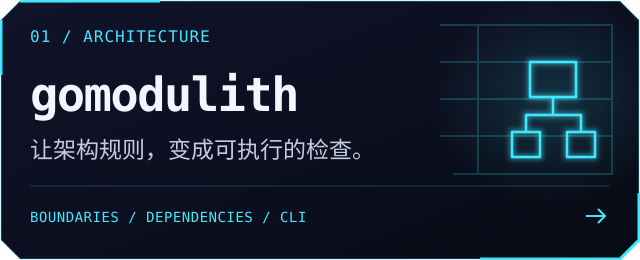
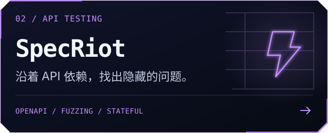
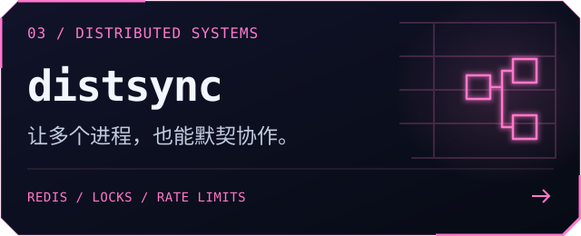
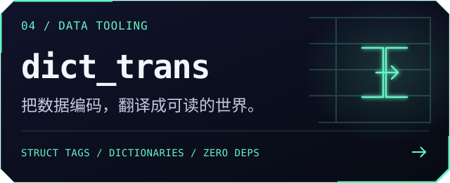

   
   
  

  <a href="https://mouxiaojun.github.io/"><b>个人博客 ↗</b></a>
  &nbsp; / &nbsp;
  <a href="https://github.com/MouXiaoJun?tab=repositories"><b>全部项目 ↗</b></a>
  &nbsp; / &nbsp;
  <a href="https://github.com/MouXiaoJun/go-design-pattern"><b>Go 设计模式 ↗</b></a>

<h3 align="center">⚡ SELECTED BUILDS / 精选项目</h3>

  
  
  
  

<a href="https://github.com/MouXiaoJun/FluxEnv"><b>FluxEnv ↗</b></a> · Rust / Tauri 桌面项目环境管理工具

  
<b>⌘ 展开项目说明与 Go 工具箱</b>

主要写 Go，关注后端工程、架构设计与开发者工具。把反复遇到的问题做成开源工具，把实践里的思考写进博客。

#### 精选项目

- **[gomodulith](https://github.com/MouXiaoJun/gomodulith)** — 让架构约定成为可执行的检查：验证模块边界、检查依赖关系，并从代码生成架构文档。
- **[SpecRiot](https://github.com/MouXiaoJun/specriot)** — 基于 OpenAPI 的 API 模糊测试：契约校验、依赖分析与有状态请求序列。
- **[distsync](https://github.com/MouXiaoJun/distsync)** — 跨进程的同步原语：基于 Redis / Valkey 的锁、信号量、限流和领导者选举。
- **[dict_trans](https://github.com/MouXiaoJun/dict_trans)** — 用 struct tag 把编码转成展示文案，支持字典、枚举、数据库和自定义翻译，零依赖。

#### Go 工具箱

| 场景 | 工具 |
| :--- | :--- |
| 数据处理 | [validator](https://github.com/MouXiaoJun/validator) · 校验 / [copier](https://github.com/MouXiaoJun/copier) · 复制 / [mask](https://github.com/MouXiaoJun/mask) · 脱敏 |
| 集合与缓存 | [set](https://github.com/MouXiaoJun/set) · 泛型集合 / [lru](https://github.com/MouXiaoJun/lru) · 缓存 |
| 日常业务 | [cny](https://github.com/MouXiaoJun/cny) · 人民币大写 / [strcase](https://github.com/MouXiaoJun/strcase) · 命名转换 / [civiltime](https://github.com/MouXiaoJun/civiltime) · 日期时间 |

[组合使用示例 →](https://github.com/MouXiaoJun/examples)

#### 工程笔记

[个人博客](https://mouxiaojun.github.io/) · [Go 设计模式与示例代码](https://github.com/MouXiaoJun/go-design-pattern)

  

