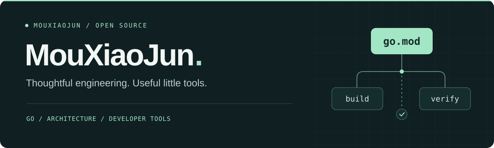

  

  <a href="https://mouxiaojun.github.io/"><b>个人博客 ↗</b></a>
  &nbsp;&nbsp; / &nbsp;&nbsp;
  <a href="https://github.com/MouXiaoJun?tab=repositories"><b>所有项目 ↗</b></a>
  &nbsp;&nbsp; / &nbsp;&nbsp;
  <a href="https://github.com/MouXiaoJun/go-design-pattern"><b>Go 设计模式 ↗</b></a>

### 你好，我是 MouXiaoJun

主要写 Go，关注后端工程、架构设计和开发者工具。喜欢把工程里反复遇到的问题，做成边界清晰、方便复用的小工具，也在博客里记录设计模式与工程实践。

`Go` · `Rust / Tauri` · `TypeScript` · `Redis / Valkey` · `OpenAPI`

### 精选项目 / Selected work

<table>
  <tr>
    <td width="50%" valign="top">
      <h3><a href="https://github.com/MouXiaoJun/gomodulith">gomodulith ↗</a></h3>
      
让架构约定成为可执行的检查。

      
Go 模块化单体工具集：验证模块边界、检查依赖关系，并从代码生成架构文档。

      
<code>Go</code> <code>Architecture</code> <code>CLI</code>

    </td>
    <td width="50%" valign="top">
      <h3><a href="https://github.com/MouXiaoJun/specriot">SpecRiot ↗</a></h3>
      
从 API 规范出发，找到请求序列里的问题。

      
基于 OpenAPI 的 API 模糊测试工具，支持契约校验、依赖分析和有状态请求序列。

      
<code>Go</code> <code>OpenAPI</code> <code>Testing</code>

    </td>
  </tr>
  <tr>
    <td width="50%" valign="top">
      <h3><a href="https://github.com/MouXiaoJun/distsync">distsync ↗</a></h3>
      
把熟悉的同步原语，带到多个进程之间。

      
基于 Redis / Valkey 的分布式同步工具，提供锁、信号量、限流和领导者选举。

      
<code>Go</code> <code>Redis</code> <code>Concurrency</code>

    </td>
    <td width="50%" valign="top">
      <h3><a href="https://github.com/MouXiaoJun/dict_trans">dict_trans ↗</a></h3>
      
让数据编码到展示文案的转换更省事。

      
零依赖的 Go 数据翻译库，用 struct tag 连接字典、枚举、数据库与自定义翻译逻辑。

      
<code>Go</code> <code>Struct tags</code> <code>Zero dependencies</code>

    </td>
  </tr>
</table>

### 小工具，也认真做 / Go toolkit

| 场景 | 工具 |
| :--- | :--- |
| 数据处理 | [copier](https://github.com/MouXiaoJun/copier) · 结构体复制 &nbsp; / &nbsp; [validator](https://github.com/MouXiaoJun/validator) · 数据校验 &nbsp; / &nbsp; [mask](https://github.com/MouXiaoJun/mask) · 数据脱敏 |
| 集合与缓存 | [set](https://github.com/MouXiaoJun/set) · 泛型集合 &nbsp; / &nbsp; [lru](https://github.com/MouXiaoJun/lru) · LRU 缓存 |
| 日常业务 | [cny](https://github.com/MouXiaoJun/cny) · 人民币大写 &nbsp; / &nbsp; [strcase](https://github.com/MouXiaoJun/strcase) · 命名转换 &nbsp; / &nbsp; [civiltime](https://github.com/MouXiaoJun/civiltime) · 日期与时间 |

组合使用可以看 [examples](https://github.com/MouXiaoJun/examples)：从校验、复制到集合处理与脱敏。

### 代码之外 / Notes & experiments

- **[个人博客](https://mouxiaojun.github.io/)** — Go 设计模式与工程随笔，把实践中的思考留下来。
- **[go-design-pattern](https://github.com/MouXiaoJun/go-design-pattern)** — 用 Go 学习设计模式，配套示例代码。
- **[FluxEnv](https://github.com/MouXiaoJun/FluxEnv)** — 基于 Rust / Tauri 的桌面项目环境管理工具。

---

把问题想清楚，把工具做简单。 Thoughtful engineering. Useful little tools.

