  

  <a href="https://mouxiaojun.github.io/"><kbd> 🌐 BLOG / 个人博客 ↗ </kbd></a>
  &nbsp;&nbsp;
  <a href="https://github.com/MouXiaoJun?tab=repositories"><kbd> ⌘ SOURCE / 所有项目 ↗ </kbd></a>
  &nbsp;&nbsp;
  <a href="https://github.com/MouXiaoJun/go-design-pattern"><kbd> ⚡ NOTES / 设计模式 ↗ </kbd></a>

  

  <b>你好，我是 MouXiaoJun。</b> 
  主要写 Go，关注后端工程、架构设计与开发者工具。 
  把反复遇到的问题做成开源工具，把实践里的思考写进博客。

  

<h2 align="center">⚡ SELECTED BUILDS</h2>

架构有边界 · 测试有状态 · 工具可复用

  
  
  
  

  
📖 项目说明 / Read the details

- **[gomodulith](https://github.com/MouXiaoJun/gomodulith)** — 让架构约定成为可执行的检查：验证模块边界、检查依赖关系，并从代码生成架构文档。
- **[SpecRiot](https://github.com/MouXiaoJun/specriot)** — 基于 OpenAPI 的 API 模糊测试：契约校验、依赖分析与有状态请求序列。
- **[distsync](https://github.com/MouXiaoJun/distsync)** — 跨进程的同步原语：基于 Redis / Valkey 的锁、信号量、限流和领导者选举。
- **[dict_trans](https://github.com/MouXiaoJun/dict_trans)** — 用 struct tag 把编码转成展示文案，支持字典、枚举、数据库和自定义翻译，零依赖。

<h2 align="center">🧩 THE TOOLBOX</h2>

一个工具，解决一类具体问题。

  <b>DATA PIPELINE</b>  
  <a href="https://github.com/MouXiaoJun/validator"><code>validator · 校验</code></a>
  → <a href="https://github.com/MouXiaoJun/copier"><code>copier · 复制</code></a>
  → <a href="https://github.com/MouXiaoJun/set"><code>set · 集合</code></a>
  → <a href="https://github.com/MouXiaoJun/mask"><code>mask · 脱敏</code></a>

  <a href="https://github.com/MouXiaoJun/lru"><code>lru · 缓存</code></a>
  &nbsp; <a href="https://github.com/MouXiaoJun/cny"><code>cny · 人民币大写</code></a>
  &nbsp; <a href="https://github.com/MouXiaoJun/strcase"><code>strcase · 命名转换</code></a>
  &nbsp; <a href="https://github.com/MouXiaoJun/civiltime"><code>civiltime · 日期时间</code></a>

<a href="https://github.com/MouXiaoJun/examples">查看这些工具如何组合使用 →</a>

<h2 align="center">🚀 BEYOND THE TERMINAL</h2>

  <b><a href="https://mouxiaojun.github.io/">工程笔记 ↗</a></b> 
  Go 设计模式与工程随笔，把代码背后的思考留下来。

  <b><a href="https://github.com/MouXiaoJun/FluxEnv">FluxEnv ↗</a></b> 
  Rust / Tauri 桌面项目环境管理工具，探索终端之外的开发体验。

  

